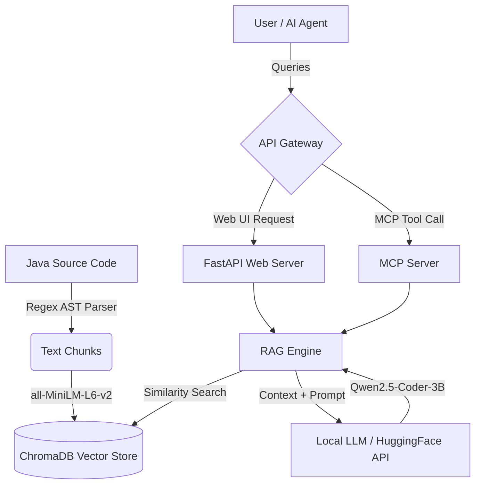

# DriveStream RAG & MCP System

This repository contains the Retrieval-Augmented Generation (RAG) and Model Context Protocol (MCP) server for the **DriveStream** project. It enables users and AI agents to query, understand, and explore the DriveStream Java codebase seamlessly.

## 🏗️ Architecture

The system is built on a modular architecture to handle code ingestion, retrieval, and generation locally using open-weights models.



### Components
1. **Ingestion (`ingestion/`)**: Parses Java files into meaningful AST chunks (classes, methods) using regex. Generates embeddings using `sentence-transformers/all-MiniLM-L6-v2` and stores them in ChromaDB.
2. **Retrieval (`retrieval/`)**: Performs cosine similarity search against ChromaDB to assemble relevant context for queries.
3. **Generation (`llm/`)**: Uses `Qwen/Qwen2.5-Coder-3B-Instruct` locally in FP16 for rapid, high-quality code generation. Fits comfortably in 12GB VRAM.
4. **Interfaces**:
   - **Web UI (`web/`)**: A premium dark-mode chat interface built with FastAPI.
   - **MCP Server (`mcp_server/`)**: Exposes the codebase tools (`ask_codebase`, `search_code`, `explain_class`) to external AI assistants via the Model Context Protocol.

---

## 🚀 Setup Guide

### 1. Prerequisites
- **Python 3.11** or 3.12 (Do not use Python 3.13 if you want local PyTorch GPU support on Windows).
- **HuggingFace Account** with an access token (for downloading models).
- (Optional) **CUDA-enabled GPU** (e.g., RTX 5070) for fast local inference.

### 2. Environment Setup

Clone the project and create a virtual environment:

```bash
cd rag-mcp
python -m venv .venv
.venv\Scripts\Activate
```

### 3. Install Dependencies (with GPU support)

To run the models on your GPU, you must install a CUDA-enabled PyTorch build **before** installing the rest of the requirements.

**For CUDA 13.2 (RTX 50-series / Blackwell):**
```bash
pip install torch torchvision --index-url https://download.pytorch.org/whl/cu132 --upgrade
```

**For older CUDA versions (e.g., CUDA 12.1):**
```bash
pip install torch==2.4.0+cu121 torchvision==0.19.0+cu121 --index-url https://download.pytorch.org/whl/cu121
```

Once PyTorch is installed, install the remaining requirements:
```bash
pip install -r requirements.txt
```

### 4. Configuration

Copy the example environment file and add your HuggingFace token:

```bash
copy .env.example .env
```

Open `.env` and configure your settings:
```properties
HF_TOKEN=your_huggingface_token_here
LLM_MODEL=Qwen/Qwen2.5-Coder-3B-Instruct
LLM_USE_API=false
LLM_LOAD_IN_4BIT=false
```

---

## 🏃‍♂️ Running the System

The system provides a unified entry point via `run.py`.

### Step 1: Ingest the Codebase
Before you can query the system, you must ingest the Java source code into the vector database.

```bash
python run.py ingest
```
*This parses the codebase, generates embeddings, and saves them to `data/chroma_db`.*

### Step 2: Start the Web UI
To chat with the codebase using a beautiful web interface:

```bash
python run.py web
```
*Navigate to **http://localhost:8000** in your browser. (The first query may take a moment as the 3B model downloads to your cache).*

### Step 3: Start the MCP Server
To expose the RAG engine to AI assistants (like Claude Desktop) via the Model Context Protocol:

**Stdio Transport (for direct integrations):**
```bash
python run.py mcp
```

**SSE Transport (for network integrations):**
```bash
python run.py mcp --transport sse --port 8001
```

---

## 🛠️ Configuration Options (`config.py`)

| Variable | Default | Description |
|----------|---------|-------------|
| `LLM_MODEL` | `Qwen/Qwen2.5-Coder-3B-Instruct` | The HuggingFace model ID to use. |
| `LLM_USE_API` | `false` | Set to `true` to use the HF Inference API instead of local GPU. |
| `LLM_LOAD_IN_4BIT` | `false` | Enable bitsandbytes 4-bit quantization (requires compatible kernels). |
| `RETRIEVAL_TOP_K` | `6` | Number of code chunks to retrieve for context. |
| `CHUNK_MAX_TOKENS`| `512` | Maximum token length for AST chunks during ingestion. |
