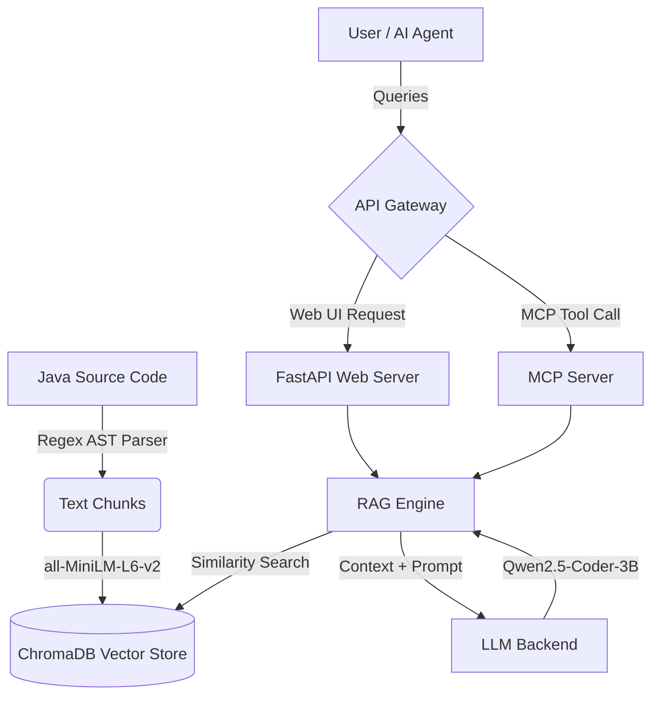

# DriveStream RAG & MCP System

This repository contains the Retrieval-Augmented Generation (RAG) and Model Context Protocol (MCP) server for the **DriveStream** project. It enables users and AI agents to query, understand, and explore the DriveStream Java codebase seamlessly.

## 🏗️ Architecture

The system is built on a modular architecture to handle code ingestion, retrieval, and generation. It can run entirely locally or use a remote/cloud LLM backend.



### Components
1. **Ingestion (`ingestion/`)**: Parses Java files into meaningful AST chunks (classes, methods) using regex. Generates embeddings using `sentence-transformers/all-MiniLM-L6-v2` and stores them in ChromaDB.
2. **Retrieval (`retrieval/`)**: Performs cosine similarity search against ChromaDB to assemble relevant context for queries.
3. **Generation (`llm/`)**: Supports local GPU inference (`local` mode), remote server proxying (`remote` mode), or cloud APIs (`hf_api` mode) for rapid, high-quality code generation.
4. **Interfaces**:
   - **Web UI (`web/`)**: A premium dark-mode chat interface built with FastAPI. 🌍 **[Try the Live Demo!](https://drivestream-rag.duckdns.org/)** Automatically deployed via GitHub Actions to an Oracle Cloud VM, monitored by OCI APM OpenTelemetry.
   - **MCP Server (`mcp_server/`)**: Exposes the codebase tools (`ask_codebase`, `search_code`, `explain_class`) to external AI assistants via the Model Context Protocol.

---

## 🚀 Setup Guide

### 1. Prerequisites
- **Python 3.11** or 3.12 (Do not use Python 3.13 if you want local PyTorch GPU support on Windows).
- **HuggingFace Account** with an access token (for downloading models).
- (Optional) **CUDA-enabled GPU** for fast local inference.

### 2. Environment Setup

Clone the project and create a virtual environment:

```bash
cd rag-mcp
python -m venv .venv
# On Windows:
.venv\Scripts\Activate
# On Linux/Mac:
source .venv/bin/activate
```

### 3. Install Dependencies

To run local models on your GPU, you must install a CUDA-enabled PyTorch build **before** installing the rest of the requirements.

**For CUDA 13.2 (RTX 50-series / Blackwell):**
```bash
pip install torch torchvision --index-url https://download.pytorch.org/whl/cu132 --upgrade
```

**For older CUDA versions (e.g., CUDA 12.1):**
```bash
pip install torch==2.4.0+cu121 torchvision==0.19.0+cu121 --index-url https://download.pytorch.org/whl/cu121
```

Once PyTorch is installed (or if you are running CPU-only), install the remaining requirements:
```bash
pip install -r requirements.txt
```

### 4. Configuration

All configuration is managed via environment variables. For local development, create a `.env` file:

```properties
HF_TOKEN=your_huggingface_token_here

# LLM Backend Mode ("local", "remote", "hf_api")
LLM_MODE=local

# If using "remote" mode (e.g., pointing to an Ngrok tunnel hosting the LLM):
LLM_REMOTE_URL=https://your-tunnel.ngrok-free.app/generate
LLM_API_KEY=optional_secret_key

# (Optional) OpenTelemetry Observability (OCI APM)
OCI_APM_ENDPOINT=https://<your-hash>.apm-agi.us-ashburn-1.oci.oraclecloud.com/...
OCI_APM_DATA_KEY=your_private_data_key
```
*Note: In production, the `.env` file is generated dynamically by the GitHub Actions CI/CD pipeline using GitHub Secrets.*

---

## 🏃‍♂️ Running the System

The system provides a unified entry point via `run.py`.

### Step 1: Ingest the Codebase
Before you can query the system, you must ingest the Java source code into the vector database.

```bash
python run.py ingest
```
*This parses the codebase, generates embeddings, and saves them to `data/chroma_db`.*

### Step 2: Start the Web UI
To chat with the codebase using a beautiful web interface:

```bash
python run.py web
```
*Navigate to **http://localhost:8000** in your browser. (The first query may take a moment as the 3B model downloads to your cache if using local mode).*

### Step 3: Start the MCP Server
To expose the RAG engine to AI assistants (like Claude Desktop) via the Model Context Protocol:

**Stdio Transport (for direct integrations):**
```bash
python run.py mcp
```

**SSE Transport (for network integrations):**
```bash
python run.py mcp --transport sse --port 8001
```

---

## 🛠️ Configuration Options (`config.py`)

| Variable | Default | Description |
|----------|---------|-------------|
| `LLM_MODEL` | `Qwen/Qwen2.5-Coder-3B-Instruct` | The HuggingFace model ID to use. |
| `LLM_MODE` | `local` | `local` (GPU), `remote` (Proxy to external server), or `hf_api`. |
| `LLM_REMOTE_URL` | `http://localhost:8080/generate` | The endpoint URL if `LLM_MODE=remote`. |
| `LLM_LOAD_IN_4BIT` | `false` | Enable bitsandbytes 4-bit quantization (requires compatible kernels). |
| `RETRIEVAL_TOP_K` | `6` | Number of code chunks to retrieve for context. |
| `CHUNK_MAX_TOKENS`| `512` | Maximum token length for AST chunks during ingestion. |
| `OCI_APM_ENDPOINT`| `""` | Oracle Cloud APM Data Upload Endpoint for OpenTelemetry. |

---

## 🚀 CI/CD & Deployment

This project uses **GitHub Actions** for automated testing and deployment.
- **Tests**: Every push runs an extensive Pytest suite for the backend and Jest for the frontend.
- **Deployment**: On success, the pipeline securely SSHs into the production Oracle VM, injects the secrets to build the `.env` file dynamically, updates the code, and restarts the `rag-mcp` systemd service. 
- **Observability**: The FastAPI app is heavily instrumented using OpenTelemetry to push distributed traces and real-time host metrics (CPU/RAM) directly to Oracle APM.
